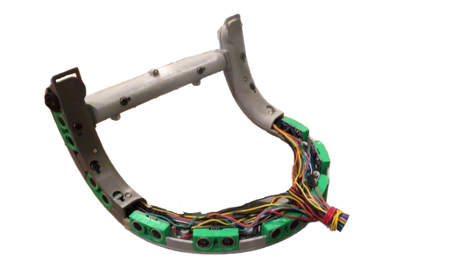
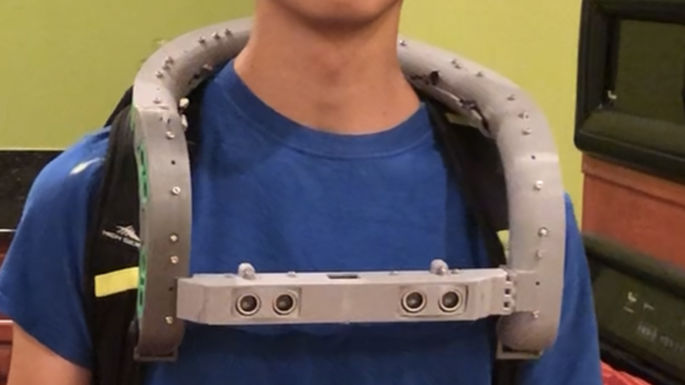
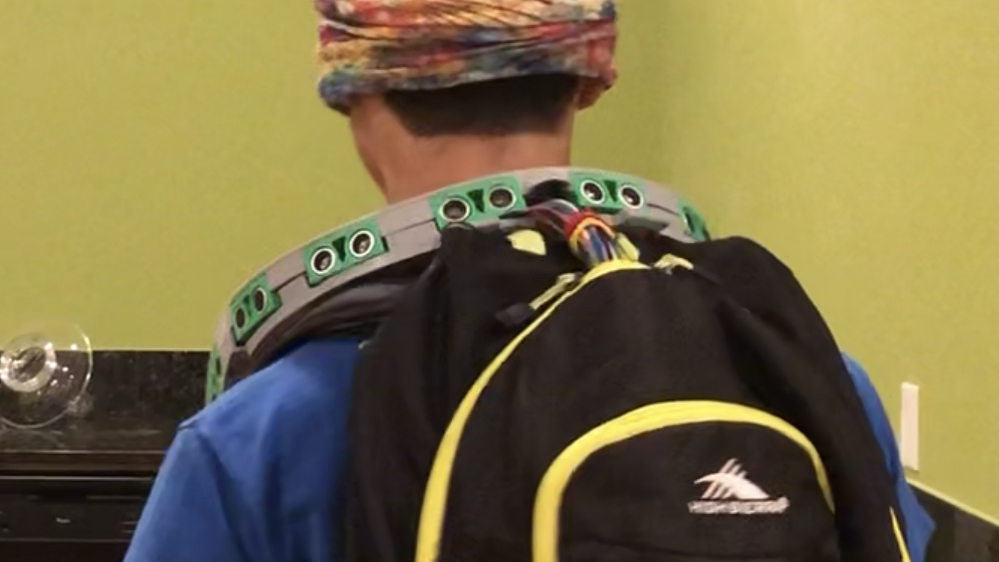
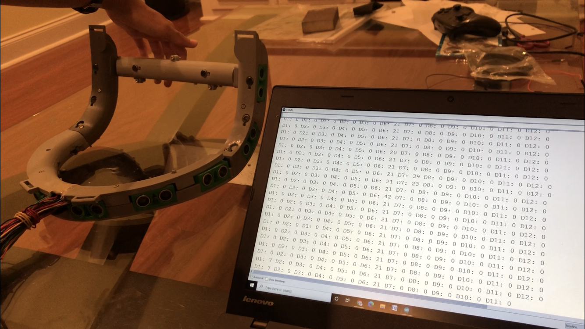

[![Contributors][contributors-shield]][contributors-url]
[![Forks][forks-shield]][forks-url]
[![Stargazers][stars-shield]][stars-url]
[![Issues][issues-shield]][issues-url]
[![MIT License][license-shield]][license-url]
[![LinkedIn][linkedin-shield]][linkedin-url]

<!-- PROJECT LOGO -->
 

  

  <h1 align="center">Visual Aid Transducer</h1>

  

    Transduce one's surroundings to haptic feedback.
     
    <a href="https://github.com/chinarjoshi/visual-aid-transducer"><strong>Explore the docs »</strong></a>
     
     
    <a href="https://youtu.be/ci213btXDe0">View Demo</a>
    ·
    <a href="https://github.com/chinarjoshi/visual-aid-transducer">Report Bug</a>
    ·
    <a href="https://github.com/chinarjoshi/visual-aid-transducer">Request Feature</a>
  

<!-- TABLE OF CONTENTS -->

  
Table of Contents

  <ol>
    <li>
      <a href="#about-the-project">About The Project</a>
      <ul>
        <li><a href="#built-with">Built With</a></li>
      </ul>
    </li>
    <li><a href="#usage">Usage</a></li>
    <li><a href="#license">License</a></li>
    <li><a href="#contact">Contact</a></li>
    <li><a href="#acknowledgements">Acknowledgements</a></li>
    <li><a href="#gallery">Gallery</a></li>
  </ol>

<!-- ABOUT THE PROJECT -->
## About The Project

<h3 align="center">
  This project was submitted to
  <a href="https://lemelson.mit.edu/inventeams">
    Lemelson-MIT Inventeam
  </a>
</h3>

### Inspiration
One of our team member's grandparents has become visually impaired, so we had the idea to create a wearable gadget to help people like him navigate the world. This project was submitted to Lemelson-MIT Inventeam, a national competition to create an innovation to benefit society.

### What it does
This is a wearable gadget that transduces the distance of obstacles to haptic feedback in order to better visualize one's surroundings.

### How we built it
The device consists of 3 main parts: a 3d printed cast to hold the electronics in the shape of a neckband, an arduino circuit to combine ultrasonic sensors, haptic feedback motors, and the microcontroller, and finally the program to create the actual function. 

### Challenges we ran into
There was initial difficulty coordinating all parts of the project. In the end, we learned effective communication skills and gained experience in the prototyping cycle.

### Accomplishments that we're proud of
We successfully created and prototyped a device that helps visually impaired people navigate the world, which has the potential to benefit society.

### Built With

* [Arduino](https://arduino.cc)
* [Adafruit Motorshield](https://adafruit.com/product/1438)

<!-- USAGE EXAMPLES -->
## Usage

Once the battery pack is connected and the driver program is uploaded, the motors will automatically begin to vibrate based on one's distance to their surroudings.

_For more examples, please refer to the [Documentation](https://github.com/chinarjoshi/visual-aid-transducer)_

<!-- LICENSE -->
## License

Distributed under the MIT License. See `LICENSE` for more information.

<!-- CONTACT -->
## Contact

Chinar Joshi - chinarjoshi7@gmail.com - [Linkedin](https://linkedin.com/in/chinar-joshi-905493207/)

Project Link: [Github](https://github.com/chinarjoshi/visual-aid-transducer)

## Acknowledgements
* [Readme Template](https://github.com/othneildrew/Best-README-Template)
* [Img Shields](https://shields.io)
* [GitHub Pages](https://pages.github.com)
* [Animate.css](https://daneden.github.io/animate.css)
* [Loaders.css](https://connoratherton.com/loaders)

## Gallery

Front view:

  

Back View:

  

  Side view:
  

  

  

  

<!-- MARKDOWN LINKS & IMAGES -->
<!-- https://www.markdownguide.org/basic-syntax/#reference-style-links -->
[contributors-shield]: https://img.shields.io/github/contributors/chinarjoshi/visual-aid-transducer?style=for-the-badge
[contributors-url]: https://github.com/chinarjoshi/visual-aid-transducer/graphs/contributors
[forks-shield]: https://img.shields.io/github/forks/chinarjoshi/visual-aid-transducer?style=for-the-badge
[forks-url]: https://github.com/chinarjoshi/visual-aid-transducer/network/members
[stars-shield]: https://img.shields.io/github/stars/chinarjoshi/visual-aid-transducer?style=for-the-badge
[stars-url]: https://github.com/chinarjoshi/visual-aid-transducer/stargazers
[issues-shield]: https://img.shields.io/github/issues/chinarjoshi/visual-aid-transducer?style=for-the-badge
[issues-url]: https://github.com/chinarjoshi/visual-aid-transducer/issues
[license-shield]: https://img.shields.io/github/license/chinarjoshi/visual-aid-transducer?style=for-the-badge
[license-url]: https://github.com/chinarjoshi/visual-aid-transducer/blob/master/LICENSE
[linkedin-shield]: https://img.shields.io/badge/-LinkedIn-black.svg?style=for-the-badge&logo=linkedin&colorB=555
[linkedin-url]: https://www.linkedin.com/in/chinar-joshi-905493207/
[product-screenshot]: images/screenshot.png
